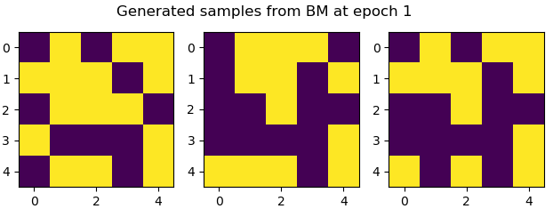
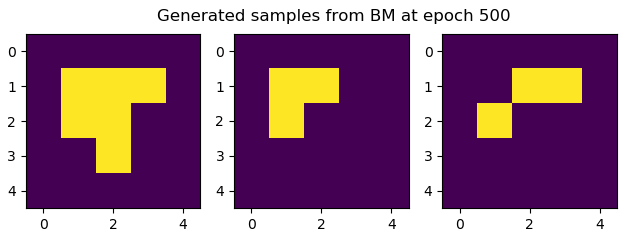
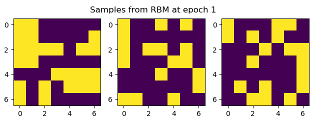
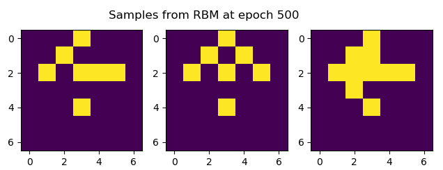
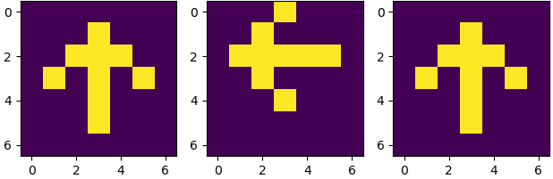

Quick implementations of some energy-based models (EBMs) just for fun (and also because I should probably know something about them).

Right now there is:
* Boltzmann machine
* Restricted Boltzmann machine
* A simple arrow image dataset for validation of models

Boltzmann machine results:

Restricted Boltzmann machine results:

Real Arrow Samples:

